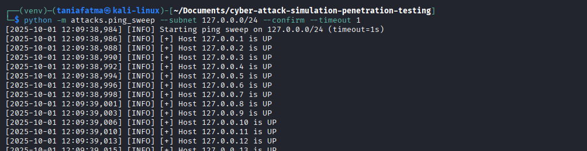
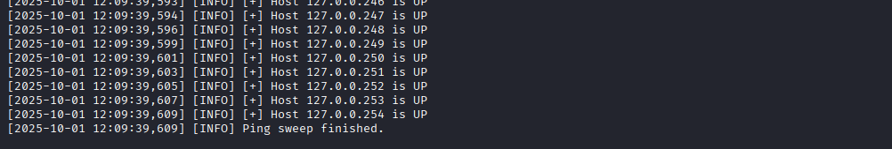
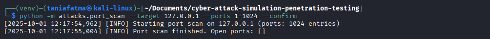
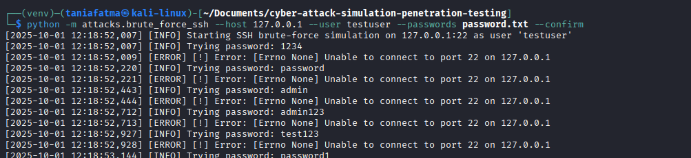
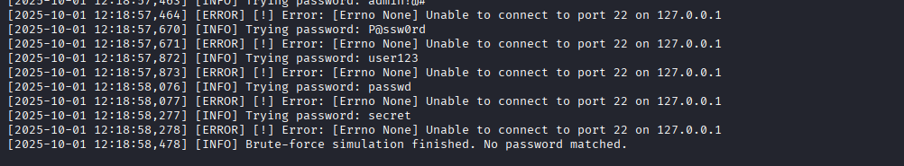
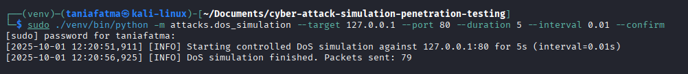

# 🚀 Cyber Attack Simulation for Penetration Testing on Kali Linux

## Project Overview

This project is an **educational simulation of common cyberattacks**, designed for learning purposes and to understand penetration testing techniques. The goals are to:

* Understand vulnerabilities in servers and networks.
* Learn how common attacks work in **controlled lab environments**.
* Analyze defensive measures and security hardening effectiveness.

**⚠️ Disclaimer:**
This repository is strictly for **educational purposes only**. Do **not** use these scripts on unauthorized systems. Misuse can be illegal and unethical.

---

## Features / Simulated Attacks

| Attack                         | Description                                     | Notes                                                   |
| ------------------------------ | ----------------------------------------------- | ------------------------------------------------------- |
| **Ping Sweep (ICMP)**          | Network reconnaissance using ICMP echo requests | Detects active hosts in a subnet (lab-only)            |
| **TCP Port Scan**              | Scan for open ports on a target host            | Connect-style scan using socket.connect()            |
| **SSH Brute Force Simulation** | Attempts password login with sample passwords   | Shows brute force risks with weak credentials       |
| **Safe DoS Simulation**        | Simulated Denial of Service attack              | Sends raw SYN packets using Scapy (requires root)       |

---

## Requirements

- **Kali Linux** (tested on 2023.3+)
- **Python 3.10+**
- Python packages:

  * `scapy` for packet crafting and analysis
  * `paramiko` for SSH simulation
  * `socket` and `subprocess` (standard library)

---

## Installation

1. Clone the repository:

```bash
git clone https://github.com/taniafatmawati/cyber-attack-simulation-penetration-testing.git
cd cyber-attack-simulation-penetration-testing
```

2. Create and activate virtual environment:

```bash
python3 -m venv venv
source venv/bin/activate
```

3. Install dependencies:

```bash
pip install -r requirements.txt
```

4. Create `logs` directory (logger will write here):

```bash
mkdir -p logs
```

---

## Important usage notes (read first)

* **Always run commands from the project root** (the directory that contains `attacks/` and `utils/`).
* **When running package modules use the module name without `.py`**. Example:

  ```bash
  # correct
  python -m attacks.port_scan --target 127.0.0.1 --ports 22,80 --confirm

  # incorrect (do not add .py)
  python -m attacks.port_scan.py ...
  ```
* If you prefer to `python attacks/script.py` directly, either:

  * set `PYTHONPATH` to project root: `PYTHONPATH=$(pwd) python attacks/ping_sweep.py ...`, or
  * add a small `sys.path` snippet at the top of the script (not recommended for production).
* **DoS simulation**: Raw-packet mode (SYN flood) uses `scapy` and **requires root** (or `CAP_NET_RAW`). Run with `sudo` or grant capability to the Python binary if you understand the risks.

---

## CLI Usage

> All example commands assume you are in the **project root** and virtualenv is active (`source venv/bin/activate`).

### 1. Ping Sweep (ICMP)

**Description:** Scan a subnet and log hosts that respond to ICMP.

**Example:**




```bash
python -m attacks.ping_sweep --subnet 127.0.0.0/24 --confirm --timeout 1
```

* `--subnet` — target subnet to scan (CIDR), required.
* `--timeout` — ICMP timeout in seconds (default: 1).
* `--confirm` — required safety flag; script exits if not present.

**Notes:**

* On some systems raw ICMP may require privileges or the `ping` binary behavior may differ. This script uses the system `ping` command; if you see permission errors check your environment.

**Logs:** Output is written to `logs/ping_sweep.log`.

---

### 2. Port Scan (TCP connect)

**Description:** Scan a target host for open TCP ports (connect-style).

**Example:**



```bash
python -m attacks.port_scan --target 127.0.0.1 --ports 22,80,443 --confirm
```

* `--target` — target IP address (required)
* `--ports` — port(s) or ranges (default: 1-1024)
* `--timeout` — socket timeout per connection (seconds), default 0.5
* `--confirm` — required safety flag

**Ports format supported:**

* Single port: `22`
* Comma-separated: `22,80,443`
* Range: `1-1024`
* Combination: `22,80,100-110`

**Notes:**

* This scanner uses `socket.connect()` which will show `Connection refused` if nothing is listening, and `timeout` if packets are dropped by firewall rules.
* If you want more verbose logs while debugging, modify `setup_logger(..., level=logging.DEBUG)` or add a `--debug` flag (recommended patch).

**Logs:** Output is written to `logs/port_scan.log`.

---

### 3. SSH Brute Force Simulation

**Description:** Attempts SSH logins with a short password list (default or provided). Uses `paramiko`.

**Example:**




```bash
python -m attacks.brute_force_ssh --host 127.0.0.1 --user testuser --passwords passwords.txt --confirm
```

* `--host` — target host (default `127.0.0.1`)
* `--user` — username (default `testuser`)
* `--passwords` — optional path to password list file
* `--confirm` — required safety flag

**Security & etiquette:**

* Use very small lists in lab (demo only). Do not run brute-force attacks on systems without explicit written permission.

**Logs:** Output is written to `logs/brute_force_ssh.log`.

---

### 4. Safe DoS Simulation

**Description:** Simulated SYN flood, uses scapy raw packets (requires root or CAP_NET_RAW).

**Example:**



```bash
sudo ./venv/bin/python -m attacks.dos_simulation --target 127.0.0.1 --port 80 --duration 5 --interval 0.01 --confirm
```

* `--target` — target host (default `127.0.0.1`)
* `--port` — target port (default 80)
* `--duration` — duration in seconds (default 5)
* `--interval` — interval between packets in seconds (default 0.01)
* `--confirm` — required safety flag

**Privilege notes:**

* If you attempt raw mode without root, you will get `PermissionError: [Errno 1] Operation not permitted`.
* To run raw mode either run Python as root (example above) or give python binary `CAP_NET_RAW` capability with `sudo setcap cap_net_raw+ep $(readlink -f ./venv/bin/python)` (remember to revoke capability after testing).

**Logs:** Output is written to `logs/dos_simulation.log`.

---

## 🔍 Extra Simulations (Command-Line Examples Only)

> **Safety first:** These commands below call powerful Kali/Linux tools. They are provided **for documentation and teaching only** — do **not** run them against systems you do not own or have explicit written permission to test. Use isolated lab VMs or intentionally vulnerable targets (e.g., `testphp.vulnweb.com`, DVWA).

| Simulation                               | Command Example                                               |
| ---------------------------------------- | ------------------------------------------------------------- |
| **Firewall Bypass (fragmented packets)** | `nmap -f 192.168.56.101`                                      |
| **SQL Injection Test**                   | `sqlmap -u "http://testphp.vulnweb.com/artists.php?artist=1"` |
| **Network Sniffing**                     | `sudo tcpdump -i eth0 -nn -w /tmp/network_traffic.pcap`       |
| **Web Vulnerability Scan**               | `nikto -h http://192.168.56.101`                              |
| **Man-in-the-Middle (ARP spoofing)**     | `ettercap -T -M arp:remote /victim/ /gateway/`                |

---

## ▶️ Execute Attack Simulations (Documentation only — RUN IN LABS ONLY)

The commands below describe common penetration testing actions. They are included *for learning* — do **not** execute them on production or unauthorized networks.

1. **Brute-Force Attack**
   - **Description:** Attempts to gain unauthorized access by trying many password combinations.
   - **Impact:** Can compromise user accounts if weak passwords are used.
   - **Target:** SSH service.
   - **Command (example):**
     ```bash
     # Hydra example (lab-only). Use a very small password list and localhost test server.
     # Example: try 10 passwords against local SSH test instance
     hydra -l testuser -P small-password-list.txt -t 4 ssh://127.0.0.1
     ```
     > *Only run against lab machines (localhost or VM). Never run against third-party hosts without explicit permission.*

2. **Firewall Bypass Attempt**
   - **Description:** Tests whether firewall rules can be evaded using packet fragmentation or other techniques.
   - **Impact:** May expose services that should be protected by the firewall.
   - **Target:** Open ports through the firewall.
   - **Commands (examples):**
     ```bash
     # Discover all ports
     nmap -p- <TARGET_IP>

     # Fragmented packets test (educational)
     nmap -f -p <TARGET_PORT> <TARGET_IP>
     ```

3. **Denial of Service (DoS) Attack**
   - **Description:** Overwhelms a service to make it unavailable.
   - **Impact:** Service disruption or downtime.
   - **Target:** Web server or application.
   - **Commands (examples):**
     ```bash
     # hping3 (controlled example for lab only — do NOT run on public targets)
     # Sends 50 SYN packets to port 80 with 1ms interval (controlled test).
     # Use only in isolated lab VMs and with permission.
     sudo hping3 -S -p 80 -c 50 -i u1000 <TARGET_IP>
     ```

4. **Man-in-the-Middle (MitM) Attack**
   - **Description:** Intercepts and potentially modifies communication between two parties.
   - **Impact:** Data leakage, credential capture, or session tampering.
   - **Target:** Network traffic between clients and servers.
   - **Commands (examples):**
     ```bash
     # MitM (Ettercap) — MANUAL LAB PROCEDURE ONLY
     # This is included for documentation. Do not automate ARP spoofing in scripts.
     # Run only in an isolated lab with explicit permission.
     sudo ettercap -T -M arp:remote /<VICTIM_IP>/ /<GATEWAY_IP>/
     
     # Capture traffic separately:
     sudo tcpdump -i eth0 -w mitm_data.pcap
     ```

5. **SQL Injection**
   - **Description:** Injects SQL queries to manipulate a backend database.
   - **Impact:** Data disclosure, unauthorized data modification, or complete DB compromise.
   - **Target:** Vulnerable web application endpoints.
   - **Command (example):**
     ```bash
     # Run sqlmap against a known test target only
     sqlmap -u "<TARGET_URL>" --dbs
     ```

6. **Network Sniffing**
   - **Description:** Captures and inspects network packets to discover sensitive information (credentials, sessions).
   - **Impact:** Exposure of unencrypted data.
   - **Target:** Network traffic on a chosen interface.
   - **Command (example):**
     ```bash
     sudo tcpdump -i eth0 -w /root/network_traffic.pcap
     ```

7. **Web Application Scanning**
   - **Description:** Automated scanning for common web vulnerabilities (XSS, SQLi, etc.).
   - **Impact:** Identifies weaknesses that require mitigation.
   - **Command (example):**
     ```bash
     nikto -h <TARGET_URL>
     ```
     
---

## ⚖️ Safety & Ethics

This project is intended for **educational purposes only**. The commands and scripts included are for learning and simulation in **controlled lab environments**.

Please follow these rules when using the repository:

* **Always** use isolated lab environments (virtual machines, containers, or purposely provisioned test networks).  
* **Never** run attacks against systems, networks, or services for which you do not have explicit written permission. Unauthorized testing may be illegal and unethical.  
* Prefer intentionally vulnerable targets (for example `testphp.vulnweb.com`, DVWA) when learning or demonstrating techniques.  
* Keep logs and capture files (PCAPs) for reproducible reporting — **do not** commit captures, credentials, or other sensitive data to source control.  
* Sanitize any results you share publicly: remove or anonymize IP addresses, hostnames, credentials, session tokens, and other sensitive artifacts.  
* Use the examples in this repository as **educational references** only. If you are uncertain whether a test is permitted, stop and obtain written authorization before proceeding.

By using this repository you agree to follow these ethical guidelines and legal obligations.

---
